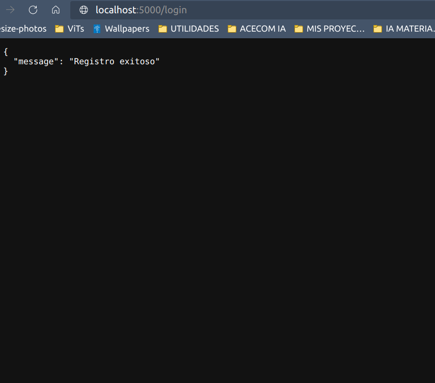
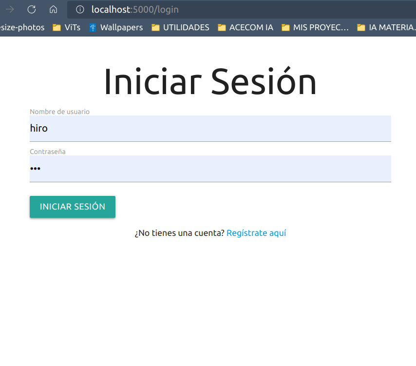

<p align="center">
    
</p>

<h2 align="center">
    <p>Aplicación de Extracción de Texto con OCR</p>
</h2>

Esta es una aplicación Flask que permite a los usuarios registrarse, subir imágenes y extraer texto de las imágenes utilizando la tecnología OCR. La aplicación también proporciona autenticación mediante tokens JWT.

## Funcionalidades

- Registro de usuarios.
- Inicio de sesión de usuarios.
- Subida de imágenes.
- Extracción de texto de imágenes mediante OCR.

## Configuración

Asegúrate de configurar las variables de entorno en un archivo `.env` con las siguientes claves:

- `JWT_SECRET_KEY`: Clave secreta para JWT (por defecto, se utiliza "super-secret").
- `UPLOAD_FOLDER`: Carpeta de carga de archivos (por defecto, "./uploads").
- `POSTGRES_HOST`: Host de la base de datos PostgreSQL.
- `POSTGRES_DB`: Nombre de la base de datos PostgreSQL.
- `POSTGRES_USER`: Usuario de PostgreSQL.
- `POSTGRES_PASSWORD`: Contraseña de PostgreSQL.

## Ejecución con Docker Compose

Para ejecutar la aplicación, sigue estos pasos:

1. Asegúrate de tener Docker y Docker Compose instalados en tu sistema.

2. Clona este repositorio en tu máquina local.

```bash
git clone https://github.com/HiroForYou/flask-ocr.git
```

Además instala los paquetes del `requirements.txt`

3. Desde la raíz del proyecto, ejecuta el siguiente comando para construir y ejecutar los contenedores Docker:

```bash
docker-compose up -d
```

4. La aplicación estará disponible en `http://localhost:5000`.

5. Puede probar cada uno de los endpoints usando los archivos de prueba dentro de la carpeta **examples/**

## Pruebas Unitarias

Puedes ejecutar pruebas unitarias con el siguiente comando:

```bash
python -m unittest discover tests
```

Debes tener ejecutando la aplicación (levantada con _docker-compose_) en segundo plano.

## Capturas de Pantalla

#### Pruebas unitarias

<div align="center">
    
</div>

#### Registro

<div align="center">
    
</div>

#### Registro exitoso

<div align="center">
    
</div>

#### Login

<div align="center">
    
</div>

#### Subir imagen

<div align="center">
    
</div>

#### Prueba de OCR

##### Imagen de prueba

<div align="center">
    
</div>

##### Resultado

<div align="center">
    
</div>

## Contribuir

Si deseas contribuir a este proyecto, ¡estamos abiertos a colaboraciones! Siéntete libre de enviar pull requests.
